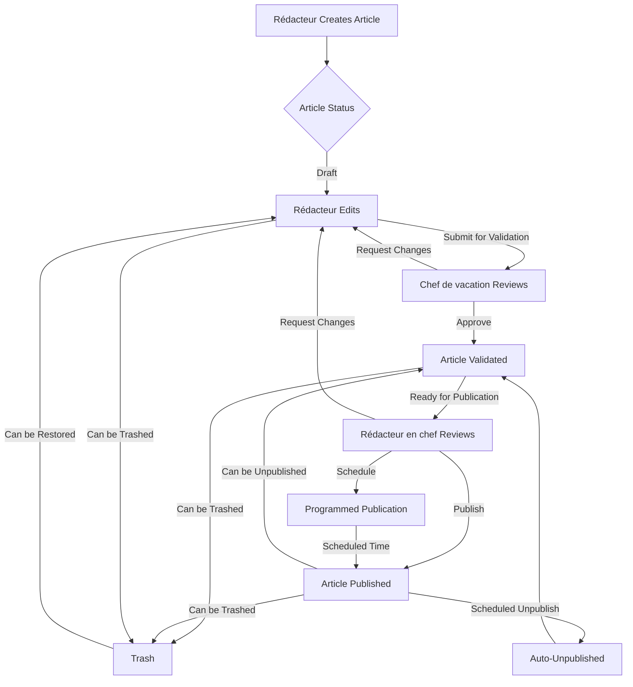

# Editorial Workflow & Article Lifecycle

## Table of Contents

- [Overview](#overview)
- [User Roles](#user-roles)
- [Article States](#article-states)
- [Editorial Workflow](#editorial-workflow)
- [Article Lifecycle](#article-lifecycle)
- [Special Features](#special-features)
- [Workflow Permissions](#workflow-permissions)

---

## Overview

The APS Dashboard implements a structured editorial workflow that ensures quality control and proper authorization at each stage of content creation and publication. This document describes the complete lifecycle of articles and other content types within the system.

---

## User Roles

### Role Hierarchy (5 Levels)

The system implements a hierarchical role structure where higher-level roles inherit permissions from lower levels and can manage users with lower-level roles.

#### Level 1: Content Creators

**Rédacteur (Writer)**
- Create and edit articles
- Submit articles for validation
- Modify own unpublished articles
- Cannot publish articles directly
- Can lock/unlock articles for editing

**Infographe (Infographer)**
- Create and manage infographics
- Upload and process images
- Same editing permissions as Rédacteur for infographic content

**Vidéaste (Videographer)**  
- Create and manage video content
- Upload video metadata and thumbnails
- Same editing permissions as Rédacteur for video content

**Photographe (Photographer)**
- Create and manage photo galleries
- Upload and organize images
- Apply watermarks to images
- Manage image metadata and credits

#### Level 2: Section Manager

**Chef de vacation (Shift Manager)**
- Validate articles created by Rédacteurs
- Manage daily content operations
- Oversee Level 1 users
- Cannot publish articles (only validate)
- Can create and edit their own articles
- Manage content scheduling

#### Level 3: Editorial Leadership

**Rédacteur en chef (Editor-in-Chief)**
- Publish validated articles
- Control what appears on the website
- Manage editorial line and content strategy
- Pin/unpin articles to homepage blocks
- Schedule article publications
- Manage all lower-level users

**Superviseur (Supervisor)**
- Similar permissions to Rédacteur en chef
- Oversee editorial operations
- Monitor workflow compliance
- System oversight and quality control

#### Level 4: System Administrator

**Admin**
- Manage users and roles
- Configure system settings
- Access to all system features
- Create and manage user accounts
- Assign/remove roles
- System configuration
- Cannot manage SuperUser accounts

#### Level 5: Super Administrator

**SuperUser**
- Complete system access
- Can manage Admin accounts
- System-level configurations
- Database management capabilities
- Security settings management

### Role Management Rules

1. **Hierarchy Enforcement**: Users can only manage roles below their level
2. **Multi-Role Assignment**: Users can have multiple roles (e.g., Rédacteur + Photographe)
3. **Interim Roles**: Temporary role assignments with expiration dates
4. **Role Inheritance**: Higher roles inherit permissions from lower roles

---

## Article States

### Primary States

Articles progress through the following states:

```
┌──────────┐     ┌─────────────┐     ┌───────────┐     ┌───────────┐
│  Draft   │────▶│  Validated  │────▶│ Published │────▶│  Archived │
└──────────┘     └─────────────┘     └───────────┘     └───────────┘
     │                  │                   │
     └──────────────────┴───────────────────┴────────▶  Trash
```

#### 1. Draft (`is_publish: false`, `is_validated: false`)
- Initial state when article is created
- Can be edited by creator
- Not visible to public
- Can be sent to trash

#### 2. Validated (`is_validated: true`, `is_publish: false`)
- Article has been reviewed and approved by Chef de vacation
- Ready for publication
- Awaiting Editor-in-Chief's decision
- Can still be edited
- Can be published or sent to trash

#### 3. Published (`is_publish: true`, `is_validated: true`)
- Article is live on the website
- Visible to public
- Has publication date (`publish_date`)
- Can be unpublished
- Can have scheduled unpublication (`publish_down`)
- View count starts accumulating

#### 4. Unpublished (returned to Validated state)
- Article removed from public view
- Returns to validated state
- Can be re-published
- Maintains publication history

#### 5. Trash (`is_trash: true`)
- Soft delete state
- Not deleted from database
- Can be restored by administrators
- Hidden from normal lists

#### 6. Archived
- Historical articles
- Stored in `aps2024_archive` table
- Maintained for historical records
- Read-only access

### Secondary States

#### Locked (`is_locked: true`)
- Prevents concurrent editing
- Automatically locked when user opens for editing
- Must be manually unlocked or times out
- Shows who locked the article and when

#### Pinned (`is_pinned: true`)
- Featured in specific homepage blocks
- Priority display position
- Managed by Rédacteur en chef
- Limited slots per block

#### Programmed (`is_programmed: true`)
- Scheduled for future publication
- Automatically published at `publish_date`
- Useful for time-sensitive content
- Can be cancelled before scheduled time

#### Protected (`is_protected: true`)
- Special protection status
- Restricted editing
- Important or sensitive content
- Additional authorization required

#### Sovereignty Content (`is_souverainete: true`)
- Special classification
- Related to national sovereignty
- May have restricted access
- Special handling in workflow

---

## Editorial Workflow

### Complete Article Workflow



### Detailed Workflow Steps

#### Step 1: Article Creation (Rédacteur)

**Actions:**
- Create new article with title, intro text, full text
- Select category and subcategory
- Choose main image
- Add tags
- Optional: Select gallery, add video link
- Optional: Add surtitle (supTitle)
- Save as draft

**System Behavior:**
- Auto-generate URL-friendly alias from title
- Set `created_by` and `created_date`
- Assign to creator's user ID
- Link to current session

**Permissions Required:**
- `article_create` privilege

#### Step 2: Article Editing (Rédacteur)

**Actions:**
- Modify article content
- Lock article before editing (prevents conflicts)
- Update metadata
- Save changes
- Unlock article

**System Behavior:**
- Update `modified_by` and `modified_date`
- Log all modifications
- Check for concurrent edits via locking mechanism

**Permissions Required:**
- `article_update` privilege
- Must be article creator or higher role

#### Step 3: Validation (Chef de vacation)

**Actions:**
- Review article content
- Check for quality, accuracy, style
- Validate or request changes
- Add validation notes

**System Behavior:**
- Set `is_validated: true`
- Set `validate_date`
- Log validation action
- Notify relevant parties

**Permissions Required:**
- `article_validate` privilege (Level 2+)

**Validation Criteria:**
- Content quality
- Grammar and spelling
- Factual accuracy
- Compliance with editorial guidelines
- Proper categorization and tagging

#### Step 4: Publication (Rédacteur en chef)

**Actions:**
- Review validated article
- Decide publication time (immediate or scheduled)
- Optionally pin to homepage block
- Publish article

**System Behavior:**
- Set `is_publish: true`
- Set `publish_date` (now or scheduled)
- Set `publish_by`
- If scheduled: Set `is_programmed: true`
- Make article visible on website
- Start view count tracking

**Permissions Required:**
- `article_publish` privilege (Level 3+)

**Publication Options:**
- **Immediate**: Published right away
- **Scheduled**: Published at future date/time
- **With Block Pinning**: Featured in specific homepage block
- **With Scheduled Unpublish**: Auto-unpublish at specified time

#### Step 5: Post-Publication Management

**Available Actions:**

1. **Unpublish**
   - Remove from public view
   - Return to validated state
   - Preserve publication history

2. **Pin/Unpin to Block**
   - Feature article in homepage block
   - Limited positions per block
   - Priority display

3. **Schedule Unpublish**
   - Set `publish_down` date
   - Auto-unpublish at specified time
   - Useful for time-sensitive content

4. **Modify Published Article**
   - Can edit published articles
   - Update `modified_by` and `modified_date`
   - Changes reflected immediately
   - Lock mechanism still applies

5. **Send to Trash**
   - Soft delete
   - Can be restored
   - Removes from public and dashboard lists

---

## Article Lifecycle

### Timeline View

```
Day 0: Creation
│
├─ Rédacteur creates article (Draft)
│  └─ Article saved with auto-generated alias
│
Day 0-1: Editing Phase
│
├─ Rédacteur edits content
│  ├─ Locks article during editing
│  ├─ Makes changes
│  └─ Unlocks article
│
Day 1: Validation Phase
│
├─ Rédacteur submits for validation
├─ Chef de vacation reviews
└─ Article validated
│
Day 1-2: Publication Decision
│
├─ Rédacteur en chef reviews
└─ Decision made:
   ├─ Option A: Immediate publication
   ├─ Option B: Scheduled publication
   └─ Option C: Request changes (back to editing)
│
Day 2+: Published State
│
├─ Article visible on website
├─ View counts accumulating
├─ Optional: Featured in homepage block
├─ Optional: Scheduled unpublish date set
│
Future: Post-Publication
│
├─ May be unpublished (returns to validated)
├─ May be re-edited and re-published
├─ May be sent to trash (soft delete)
└─ Eventually: Archived for historical record
```

### Key Timestamps

Articles track multiple timestamps throughout their lifecycle:

- `created_date`: Initial creation
- `modified_date`: Last modification
- `validate_date`: When validated
- `publish_date`: When published (or scheduled for)
- `publish_down`: Scheduled unpublish date
- `locked_date`: When locked for editing

### Metadata Tracking

The system tracks who performed each action:

- `created_by`: Username of creator
- `modified_by`: Username of last modifier
- `publish_by`: Username who published
- `unpublish_by`: Username who unpublished
- `trash_by`: Username who trashed
- `locked_by`: Username who locked

---

## Special Features

### Article Locking

**Purpose**: Prevent concurrent editing conflicts

**How it Works:**
1. User clicks "Edit" on an article
2. System checks if article is locked
3. If unlocked: Lock article, assign to user
4. If locked by same user: Allow editing
5. If locked by another user: Show warning with lock info
6. User must explicitly unlock or timeout occurs

**Lock Information:**
- Who locked the article (`locked_by`)
- When locked (`locked_date`)
- Lock status (`is_locked`)

**Unlock Conditions:**
- User manually unlocks
- Timeout period expires
- Administrator force-unlocks

### Article Pinning & Blocks

**Homepage Blocks:**
The homepage is divided into several content blocks:

1. **Block 1** (La Une / Top News)
2. **Block 2** (Actualités / Current News)
3. **Block 3** (Various categories)
4. **Block 4-7** (Specialized sections)

Each block can have multiple positions (typically 3-4 articles).

**Pinning Process:**
1. Rédacteur en chef selects published article
2. Chooses target block and position
3. System assigns article to that position
4. Article appears in that block on homepage
5. Previous article in that position is unpinned

**Rules:**
- Only published articles can be pinned
- Each position holds one article
- Unpinned articles still appear in regular lists
- Pinned status is independent of publication status

### Scheduled Publishing

**Use Cases:**
- Embargo content (not to be published before specific time)
- Time-zone optimized publishing
- Planned content campaigns
- Automated weekend/holiday publishing

**How it Works:**
1. Editor schedules article with future `publish_date`
2. Article marked as `is_programmed: true`
3. Background job or cron checks for due articles
4. At scheduled time: Article automatically published
5. `is_programmed` set to `false`

**Scheduled Unpublishing:**
- Similar process with `publish_down` field
- Article automatically unpublished at specified time
- Returns to validated state

### Category & Tag Management

**Categories:**
- Hierarchical structure (category > subcategory)
- Examples: Politics, Economy, Sports, Culture
- Each article must have one category
- Optional subcategory for more specific classification

**Tags:**
- Flexible, non-hierarchical
- Multiple tags per article
- Used for search and content discovery
- Managed separately, reusable across articles

**Default Category:**
- System maintains a default category
- Used for uncategorized content
- Configurable by administrators

### Dossiers (Thematic Collections)

**Purpose**: Group related articles by theme or topic

**Features:**
- Multiple articles per dossier
- Dossier has its own page
- Featured image and description
- Publish/unpublish independent of articles
- Articles can belong to multiple dossiers

**Workflow:**
1. Admin creates dossier
2. Editors add articles to dossier
3. Publish dossier when ready
4. Dossier page displays all included articles

---

## Workflow Permissions

### Permission Matrix

| Action | Rédacteur | Chef de vacation | Rédacteur en chef | Admin | SuperUser |
|--------|-----------|------------------|-------------------|-------|-----------|
| Create Article | ✅ | ✅ | ✅ | ✅ | ✅ |
| Edit Own Draft | ✅ | ✅ | ✅ | ✅ | ✅ |
| Edit Other's Draft | ❌ | ✅ | ✅ | ✅ | ✅ |
| Submit for Validation | ✅ | ✅ | ✅ | ✅ | ✅ |
| Validate Article | ❌ | ✅ | ✅ | ✅ | ✅ |
| Publish Article | ❌ | ❌ | ✅ | ✅ | ✅ |
| Unpublish Article | ❌ | ❌ | ✅ | ✅ | ✅ |
| Pin to Block | ❌ | ❌ | ✅ | ✅ | ✅ |
| Schedule Publish | ❌ | ❌ | ✅ | ✅ | ✅ |
| Lock/Unlock | ✅ | ✅ | ✅ | ✅ | ✅ |
| Send to Trash | ✅ (own) | ✅ | ✅ | ✅ | ✅ |
| Restore from Trash | ❌ | ❌ | ✅ | ✅ | ✅ |
| Delete Permanently | ❌ | ❌ | ❌ | ✅ | ✅ |
| View Analytics | ✅ | ✅ | ✅ | ✅ | ✅ |

### Content-Type Specific Permissions

**Images & Galleries:**
- Photographers have extended permissions
- Can create, edit, delete galleries
- Can upload multiple images
- Can apply watermarks

**Videos:**
- Vidéastes have extended permissions
- Can upload video metadata
- Can set main video flag
- Can pin videos to homepage

**Infographics:**
- Infographes have extended permissions
- Similar workflow to articles
- Simplified validation process

**Banners:**
- Admin level required
- Control homepage and category banners
- Position management
- Click tracking

**Emergency Band:**
- Rédacteur en chef+ required
- Breaking news alert
- Overrides normal content
- Time-sensitive publishing

---

## Workflow Best Practices

### For Rédacteurs

1. **Always save drafts frequently**
2. **Lock articles before editing** to prevent conflicts
3. **Unlock when done** to allow others to work
4. **Submit for validation** when content is ready
5. **Respond promptly** to change requests
6. **Use descriptive titles** that auto-generate good aliases
7. **Tag appropriately** for better discoverability
8. **Choose correct category** for proper classification

### For Chef de vacation

1. **Review articles promptly** to avoid bottlenecks
2. **Provide clear feedback** when requesting changes
3. **Check for quality** before validation
4. **Verify facts and sources**
5. **Ensure style guide compliance**
6. **Monitor daily workflow** and deadlines
7. **Communicate with team** about priorities

### For Rédacteur en chef

1. **Strategic publication timing**
2. **Homepage block curation** for best user experience
3. **Monitor published content quality**
4. **Use scheduled publishing** for off-hours content
5. **Set unpublish dates** for time-sensitive content
6. **Balance content categories** on homepage
7. **Review analytics** to optimize publishing strategy

### For Administrators

1. **Monitor system health**
2. **Manage user accounts and roles**
3. **Configure system settings**
4. **Review security logs**
5. **Handle escalated issues**
6. **Maintain backup procedures**
7. **Update documentation**

---

## Troubleshooting Common Workflow Issues

### Article Stuck in Draft

**Symptom**: Cannot submit for validation

**Solutions**:
- Check required fields are filled
- Verify user has validation permission
- Check article lock status
- Review validation logs

### Cannot Publish Validated Article

**Symptom**: Publish button not available

**Solutions**:
- Verify article is validated (`is_validated: true`)
- Check user role (Level 3+ required)
- Ensure article is not locked by another user
- Check for scheduled conflicts

### Article Not Appearing on Website

**Symptom**: Published but not visible

**Checklist**:
- Verify `is_publish: true`
- Check `publish_date` is not in future
- Confirm not sent to trash
- Check category is enabled
- Verify no `publish_down` date passed
- Clear cache if applicable

### Concurrent Edit Conflicts

**Symptom**: Changes lost or overwritten

**Prevention**:
- Always use lock mechanism
- Check who locked article before force-unlock
- Implement timeout policies
- Train users on proper locking procedures

---

## Notifications & Alerts

### Email Notifications

The system sends email notifications for:

- Article submitted for validation
- Article validated
- Article published
- Change requests from validators/editors
- Article locked by another user warning
- Scheduled publish reminders

### Dashboard Notifications

Users see notifications for:

- Articles awaiting their action
- Articles returned for changes
- Articles approaching deadlines
- System-wide announcements

---

## Reporting & Analytics

### Available Reports

1. **Article Production Report**
   - Articles created per user
   - Articles by state
   - Time from creation to publication

2. **Workflow Efficiency Report**
   - Average time in each state
   - Bottlenecks identification
   - Validation/publication rates

3. **User Activity Report**
   - Actions per user
   - Most active contributors
   - Role-based performance

4. **Content Performance Report**
   - Most viewed articles
   - Engagement metrics
   - Category performance

---

**Last Updated**: 2025-10-26  
**Document Version**: 1.0
